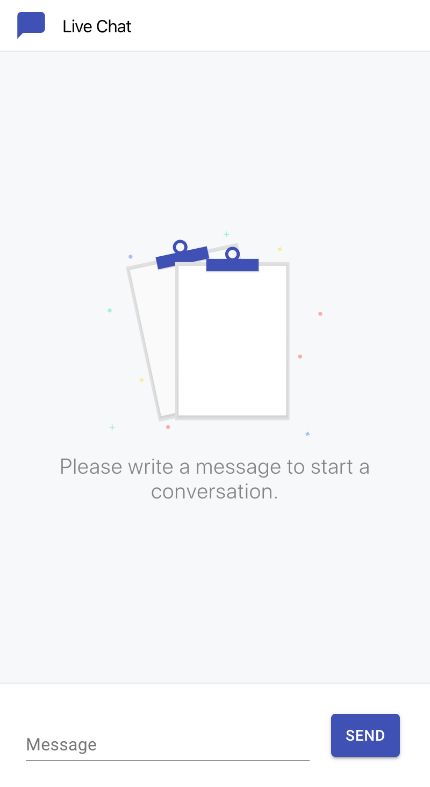
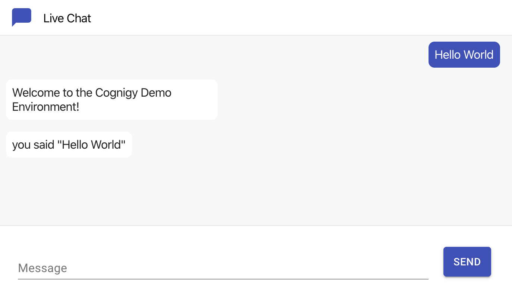

[![Issues][issues-shield]][issues-url]
[![MIT License][license-shield]][license-url]

<br />
<p align="center">
  <a href="https://github.com/LeonErath/cognigy-challenge">
    
  </a>

  <h3 align="center">Cognigy Interview Challenge</h3>

  <p align="center">
    Development of a Web-based Chatbot UI that connects to Cognigy
  </p>
</p>

<!-- ABOUT THE PROJECT -->

## About The Project





### Requirements 

| ID    | Description                                                  | Impl. |
| :---- | ------------------------------------------------------------ | :---: |
| R.1   | connects to an existing Cognigy.AI bot                       |   ✓   |
| R.2   | shows a text input field with a “send” button                |   ✓   |
| R.2.1 | Clicking ‘send’ or hitting ‘return’ should send a message to the bot |   ✓   |
| R.3   | receives messages from the Cognigy.AI bot                    |   ✓   |
| R.4   | shows a graphical conversation history with “chat bubbles” for user and bot messages |   ✓   |
| R.4.1 | The bubbles should be visually distinguishable by alignment and color depending on their source (user or bot) |   ✓   |


### Built With

- [React](https://reactjs.org)
- [TypeScript](https://www.typescriptlang.org)
- [Redux](https://redux.js.org)

<!-- GETTING STARTED -->

## Getting Started

To get a local copy up and running follow these simple steps.

### Prerequisites

- yarn or npm

### Installation

```sh
git clone https://github.com/LeonErath/cognigy-challenge.git
cd cognigy-challenge
yarn install
```

### Development

To setup the local development enviroment follow these steps:

```sh
yarn start
```

The web application will then be available under [http://localhost:3000/](http://localhost:3000/).

<!-- LICENSE -->

## License

Distributed under the MIT License. See `LICENSE` for more information.

<!-- CONTACT -->

## Contact

Leon Erath- [@leonerath](https://twitter.com/leonerath) - leon-erath@hotmail.de

Project Link: [https://github.com/LeonErath/cognigy-challenge](https://github.com/LeonErath/cognigy-challenge)

[issues-shield]: https://img.shields.io/github/issues/LeonErath/cognigy-challenge?style=flat-square
[issues-url]: https://github.com/LeonErath/cognigy-challenge/issues
[license-shield]: https://img.shields.io/github/license/LeonErath/cognigy-challenge?style=flat-square
[license-url]: https://github.com/LeonErath/cognigy-challenge/blob/master/LICENSE
[product-screenshot]: images/screenshot.png
